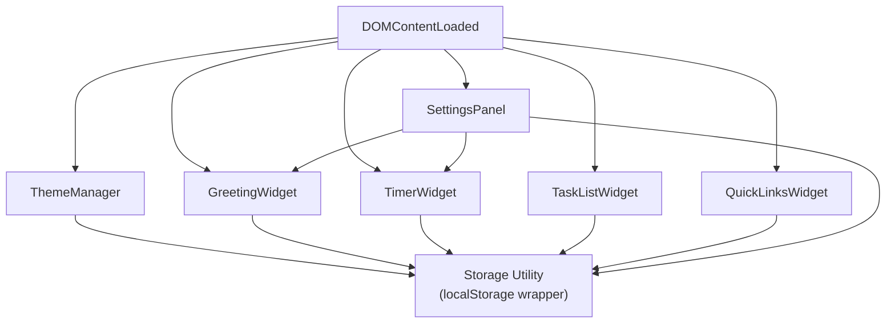
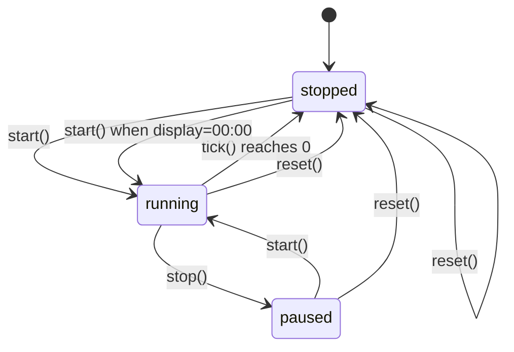

# Design Document: Personal Dashboard

## Overview

The Personal Dashboard is a zero-dependency, single-page web application delivered as a standalone HTML file. It runs entirely in the browser with no server, no build tools, and no third-party libraries. All user data is persisted through the Browser `localStorage` API.

The application is composed of five functional widgets rendered on one page:

1. **Greeting Widget** — live clock, date, and time-of-day greeting with optional personalized name
2. **Focus Timer** — Pomodoro-style countdown with configurable duration and browser notification support
3. **Task List** — full CRUD to-do list with completion tracking
4. **Quick Links** — user-defined shortcut buttons that open in a new tab
5. **Settings Panel** — name input, timer duration input, and theme toggle

The entire codebase is three files:

```
index.html      — markup and widget structure
css/styles.css  — all styling, CSS custom properties for theming
js/app.js       — all application logic
```

### Design Goals

- **No external dependencies** — ships as a folder that opens directly with `File > Open` in any modern browser
- **Offline-first** — all data stored in `localStorage`; no network calls
- **Single source of truth per widget** — each widget owns its data slice in storage and in DOM
- **Graceful degradation** — storage failures log errors and render default state; no crash

---

## Architecture

The application follows a straightforward **Module-per-Widget** pattern inside a single IIFE (Immediately Invoked Function Expression) in `app.js`. Each widget is represented by a plain object (or a set of closely grouped functions) with a consistent lifecycle:

```
init()         — reads storage, binds events, renders initial state
render()       — writes to DOM from in-memory state
persist()      — serializes in-memory state to localStorage
```

A small `Storage` utility wraps every `localStorage` call so all read/write failures are handled in one place.

### Initialization Order

On `DOMContentLoaded`, the app initializes widgets in the following order to ensure theme is applied before any content renders, preventing a flash of the wrong theme:

```
1. ThemeManager.init()         — apply theme before paint
2. GreetingWidget.init()       — start clock interval
3. TimerWidget.init()          — load saved duration
4. TaskListWidget.init()       — load saved tasks
5. QuickLinksWidget.init()     — load saved links
6. SettingsPanel.init()        — bind name/duration inputs
```

### Module Dependency Diagram



---

## Components and Interfaces

### Storage Utility

Centralizes all `localStorage` interactions. Every call is wrapped in a `try/catch`.

```js
Storage.get(key)           // returns parsed value or null; logs on read error
Storage.set(key, value)    // serializes and writes; silently ignores write errors
Storage.remove(key)        // removes key; silently ignores errors
```

Storage keys:

| Key                       | Widget          | Value type         |
|---------------------------|-----------------|--------------------|
| `dashboard_tasks`         | TaskListWidget  | `Task[]` (JSON)    |
| `dashboard_links`         | QuickLinksWidget| `Link[]` (JSON)    |
| `dashboard_name`          | SettingsPanel   | `string`           |
| `dashboard_timer_duration`| TimerWidget     | `number` (minutes) |
| `dashboard_theme`         | ThemeManager    | `"light"` \| `"dark"` |

### ThemeManager

Applies the active theme by toggling a `data-theme` attribute on `<html>`. CSS custom properties keyed to that attribute drive all colors.

```js
ThemeManager.init()        // reads storage, falls back to prefers-color-scheme, then "light"
ThemeManager.toggle()      // flips theme, persists, updates toggle icon
ThemeManager.apply(theme)  // sets data-theme attribute, updates toggle aria-label
```

### GreetingWidget

Owns the clock interval. Reads name from storage on init and re-reads whenever `SettingsPanel` fires a `namechange` custom event.

```js
GreetingWidget.init()           // start setInterval(tick, 1000), render
GreetingWidget.tick()           // update time/date display
GreetingWidget.getGreeting(hour)// returns greeting string for given hour
GreetingWidget.formatTime(date) // returns locale-aware time string
GreetingWidget.formatDate(date) // returns "Weekday, Month Day, Year" string
```

Greeting logic:

| Hour range    | Greeting        |
|---------------|-----------------|
| 5–11          | Good morning    |
| 12–17         | Good afternoon  |
| 18–21         | Good evening    |
| 22–23, 0–4    | Good night      |

### TimerWidget

Manages a `setInterval` for the countdown. State machine with three states: `stopped`, `running`, `paused`.

```js
TimerWidget.init()              // load duration, render controls
TimerWidget.start()             // transition to running state
TimerWidget.stop()              // transition to paused state
TimerWidget.reset()             // stop interval, reset to configured duration
TimerWidget.tick()              // decrement remaining seconds, check for completion
TimerWidget.onComplete()        // stop, play beep, fire notification if permitted
TimerWidget.renderControls()    // enable/disable Start and Stop buttons
TimerWidget.formatTime(secs)    // returns "MM:SS" string
```

Timer state transitions:



### TaskListWidget

Holds tasks in an in-memory array. Each task has a generated `id` (using `Date.now() + Math.random()`).

```js
TaskListWidget.init()               // load from storage, render
TaskListWidget.addTask(text)        // validate, push to array, persist, render
TaskListWidget.deleteTask(id)       // filter array, persist, render
TaskListWidget.toggleComplete(id)   // flip completed flag, persist, render
TaskListWidget.startEdit(id)        // replace task row with edit controls
TaskListWidget.saveEdit(id, text)   // validate, update text, persist, render
TaskListWidget.cancelEdit(id)       // re-render row with original text
TaskListWidget.render()             // rebuild task list DOM from in-memory array
```

### QuickLinksWidget

Holds links in an in-memory array with a maximum of 20 entries.

```js
QuickLinksWidget.init()             // load from storage, render
QuickLinksWidget.addLink(label, url)// validate, normalise URL, push, persist, render
QuickLinksWidget.deleteLink(id)     // filter array, persist, render
QuickLinksWidget.normaliseUrl(url)  // prepend "https://" if no http/https scheme
QuickLinksWidget.validateUrl(url)   // checks for scheme + non-empty host + no whitespace
QuickLinksWidget.render()           // rebuild panel DOM
```

### SettingsPanel

Binds form controls for name and timer duration. Dispatches custom DOM events when values change so dependent widgets can react.

```js
SettingsPanel.init()                // bind name input, duration input events
SettingsPanel.saveName(value)       // validate, persist, dispatch 'namechange' event
SettingsPanel.saveDuration(value)   // validate, persist, dispatch 'durationchange' event
```

---

## Data Models

### Task

```js
{
  id: string,          // unique identifier: `${Date.now()}-${Math.random()}`
  text: string,        // 1–200 characters
  completed: boolean,  // false on creation
  createdAt: number    // Date.now() at creation time
}
```

### Link

```js
{
  id: string,          // unique identifier
  label: string,       // 1–50 characters, display name
  url: string          // valid URL, 1–2048 characters, always has http/https scheme
}
```

### Stored Theme

Plain string: `"light"` or `"dark"`.

### Stored Name

Plain string: 1–50 non-whitespace-only characters, or absent from storage.

### Stored Duration

Integer in range 1–120. Default: 25.

---

## Correctness Properties

*A property is a characteristic or behavior that should hold true across all valid executions of a system — essentially, a formal statement about what the system should do. Properties serve as the bridge between human-readable specifications and machine-verifiable correctness guarantees.*

### Property 1: Greeting reflects current hour

*For any* hour value in 0–23, `GreetingWidget.getGreeting(hour)` SHALL return exactly one of the four greeting strings, and the returned string SHALL be consistent with the hour-range mapping defined in the requirements (5–11 → "Good morning", 12–17 → "Good afternoon", 18–21 → "Good evening", 22–23 or 0–4 → "Good night").

**Validates: Requirements 1.3, 1.4, 1.5, 1.6**

---

### Property 2: Greeting with name appended

*For any* valid name string (1–50 characters, at least one non-whitespace character), the full greeting string SHALL equal `<time-of-day greeting> + ", " + name`. For any absent or whitespace-only name, the greeting SHALL equal only the time-of-day greeting with no trailing suffix.

**Validates: Requirements 1.7, 1.8, 2.3, 2.6**

---

### Property 3: Name validation and persistence round-trip

*For any* string submitted as a custom name: if it is 1–50 characters and contains at least one non-whitespace character, `Storage.get("dashboard_name")` SHALL equal that string after a save; if it is empty, whitespace-only, or exceeds 50 characters, `Storage.get("dashboard_name")` SHALL NOT be updated.

**Validates: Requirements 2.2, 2.5, 2.6**

---

### Property 4: Timer countdown correctness

*For any* configured duration D (1–120 minutes), after the timer starts and N seconds have elapsed (0 ≤ N ≤ D×60), `TimerWidget.formatTime(remaining)` SHALL display `MM:SS` where remaining = D×60 − N, and the displayed value SHALL never go below `00:00`.

**Validates: Requirements 3.2, 3.7**

---

### Property 5: Timer controls enabled/disabled state invariant

*For any* timer state (stopped, running, paused), the Start button SHALL be enabled if and only if the timer is NOT running, and the Stop button SHALL be enabled if and only if the timer IS running.

**Validates: Requirements 3.8**

---

### Property 6: Timer duration persistence round-trip

*For any* integer D in 1–120, saving D as the timer duration SHALL result in `Storage.get("dashboard_timer_duration")` returning D. For any value outside 1–120 or any non-integer, the stored duration SHALL remain unchanged.

**Validates: Requirements 4.2, 4.6**

---

### Property 7: Task addition grows the list

*For any* existing task list and any valid task text (1–200 non-whitespace-only characters), calling `addTask(text)` SHALL increase the task array length by exactly one, and the new task SHALL appear in the persisted list.

**Validates: Requirements 5.2**

---

### Property 8: Invalid task text is rejected

*For any* string that is empty or exceeds 200 characters, `addTask(text)` SHALL leave the task array unchanged and SHALL NOT write the invalid task to storage.

**Validates: Requirements 5.3, 5.8**

---

### Property 9: Task persistence round-trip

*For any* sequence of add/delete/toggle/edit operations, serializing the in-memory task array to storage and then deserializing it SHALL produce an array equal to the original (same ids, texts, completed flags, and order).

**Validates: Requirements 5.2, 5.5, 5.7, 5.10, 5.11**

---

### Property 10: Quick link URL normalisation

*For any* URL string that does not start with `"http://"` or `"https://"`, `QuickLinksWidget.normaliseUrl(url)` SHALL return the URL with `"https://"` prepended. For any URL already starting with `"http://"` or `"https://"`, the URL SHALL be returned unchanged.

**Validates: Requirements 6.5**

---

### Property 11: Quick links persistence round-trip

*For any* list of valid links (up to 20), serializing to storage and deserializing SHALL produce a list equal to the original (same ids, labels, urls, and order).

**Validates: Requirements 6.2, 6.8, 6.9**

---

### Property 12: Quick links maximum enforced

*For any* panel already holding exactly 20 links, calling `addLink(label, url)` SHALL leave the list at 20 entries and SHALL NOT write a 21st entry to storage.

**Validates: Requirements 6.11**

---

### Property 13: Theme toggle is an involution

*For any* active theme T, calling `ThemeManager.toggle()` twice in succession SHALL result in the same theme T being active, and `Storage.get("dashboard_theme")` SHALL equal T.

**Validates: Requirements 7.2, 7.3**

---

### Property 14: Theme persistence round-trip

*For any* theme value `"light"` or `"dark"`, persisting it and reloading (re-reading from storage) SHALL apply the same theme.

**Validates: Requirements 7.3, 7.4**

---

### Property 15: `formatTime` correctness

*For any* integer S in 0–7200 (representing seconds, for a max 120-minute timer), `TimerWidget.formatTime(S)` SHALL return a string matching `MM:SS` where MM = floor(S/60) zero-padded to 2 digits and SS = S mod 60 zero-padded to 2 digits.

**Validates: Requirements 3.1**

---

## Error Handling

### Storage Failures

All storage operations go through the `Storage` utility.

| Operation | Failure handling |
|-----------|-----------------|
| Read (init) | `console.error` with descriptive message; widget renders with documented defaults |
| Write (user action) | Silent — no error logged, no crash; UI retains current in-memory state |
| Read (tasks, links) | Widget renders empty list; displays inline error indication to user |

This directly maps to Requirements 8.3 and 8.4.

### Validation Errors

Validation is checked before any state mutation or storage write. Inline error messages are injected adjacent to the offending input field and cleared on the next valid submission.

| Widget | Invalid input | Message placement |
|--------|--------------|-------------------|
| SettingsPanel (name) | > 50 chars or whitespace-only | Below name input |
| SettingsPanel (duration) | Outside 1–120 or non-integer | Below duration input |
| TaskListWidget | Empty or > 200 chars | Below task input |
| QuickLinksWidget | Missing label, missing/invalid URL, limit reached | Below the respective input |

### Timer Completion

When the countdown reaches zero:
1. The interval is cleared.
2. The Web Audio API is used to synthesise a short beep tone (no external audio file required).
3. If `Notification.permission === "granted"`, a browser notification is fired.
4. Start/Stop buttons are updated to reflect the stopped state.

The beep is generated using `AudioContext` + `OscillatorNode`. If `AudioContext` is unavailable (very rare in target browsers), the beep step is silently skipped.

### Browser Notification

The app does **not** proactively request notification permission. It only fires a notification if permission was previously granted. This avoids intrusive permission prompts.

---

## Testing Strategy

### Unit Tests (example-based)

Unit tests cover specific examples, edge cases, and boundary conditions using a minimal test runner (e.g., plain assertions or a lightweight library like [uvu](https://github.com/lukeed/uvu)).

Key unit test targets:

- `GreetingWidget.getGreeting(hour)` — one example per hour boundary (5, 11, 12, 17, 18, 21, 22, 0, 4)
- `GreetingWidget.formatDate(date)` — correct full-name format for a known date
- `TimerWidget.formatTime(seconds)` — boundary values: 0, 59, 60, 3599, 7200
- `QuickLinksWidget.normaliseUrl(url)` — already-prefixed URLs, bare domains, `http://` vs `https://`
- `QuickLinksWidget.validateUrl(url)` — valid URLs, missing scheme, whitespace, empty string
- Name validation — exactly 50 chars, 51 chars, whitespace-only, empty
- Duration validation — 1, 120, 0, 121, 25.5, non-numeric

### Property-Based Tests

Property-based tests verify the universal properties listed in the Correctness Properties section. The recommended library for a no-build Vanilla JS project is [fast-check](https://fast-check.dev/) (can be loaded from a CDN in a test HTML file without a build step).

Each property test runs a **minimum of 100 iterations**.

Each test is tagged with a comment in the format:
> `// Feature: personal-dashboard, Property N: <property_text>`

| Property | Test description | Generator |
|----------|-----------------|-----------|
| 1 | `getGreeting(h)` returns correct string for all hours | `fc.integer({min:0, max:23})` |
| 2 | Full greeting string with and without name | `fc.integer({min:0,max:23})`, `fc.string({minLength:1, maxLength:50})` filtered to non-whitespace |
| 3 | Name validation: valid saves, invalid does not | `fc.string({maxLength:60})` |
| 4 | Timer display never below 00:00 | `fc.integer({min:1,max:120})` for D, `fc.integer({min:0})` for N |
| 5 | Start/Stop button state invariant | `fc.constantFrom('stopped','running','paused')` |
| 6 | Duration persistence round-trip | `fc.integer({min:1,max:120})` and out-of-range values |
| 7 | Task addition grows list | `fc.array(taskArb)`, `fc.string({minLength:1,maxLength:200})` |
| 8 | Invalid task rejected | Empty string and `fc.string({minLength:201})` |
| 9 | Task array serialisation round-trip | `fc.array(taskArb, {maxLength:50})` |
| 10 | URL normalisation | `fc.webUrl()` and bare-domain strings |
| 11 | Links array serialisation round-trip | `fc.array(linkArb, {maxLength:20})` |
| 12 | 20-link cap enforced | `fc.array(linkArb, {minLength:20, maxLength:20})` + one extra |
| 13 | Theme toggle is involution | `fc.constantFrom('light','dark')` |
| 14 | Theme persistence round-trip | `fc.constantFrom('light','dark')` |
| 15 | `formatTime` MM:SS correctness | `fc.integer({min:0, max:7200})` |

### Integration / Smoke Tests

- Open `index.html` in each target browser (Chrome, Firefox, Edge, Safari) and verify:
  - No uncaught JS errors in the console
  - All widgets render with default state
  - `localStorage` keys are written after first interaction
  - Theme persists across page reload
  - Tasks and links persist across page reload

### Responsive Layout Checks

- Manually verify grid layout at viewport widths: 320 px, 767 px, 768 px, 1280 px
- Automated: use a CSS media query assertion library or browser DevTools snapshot

### Accessibility Checks

- All interactive controls have accessible labels (`aria-label` or visible `<label>`)
- Colour contrast meets WCAG AA for both light and dark themes
- Keyboard navigation cycles through all controls in logical order
